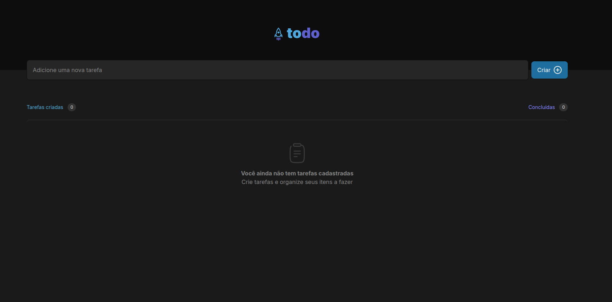
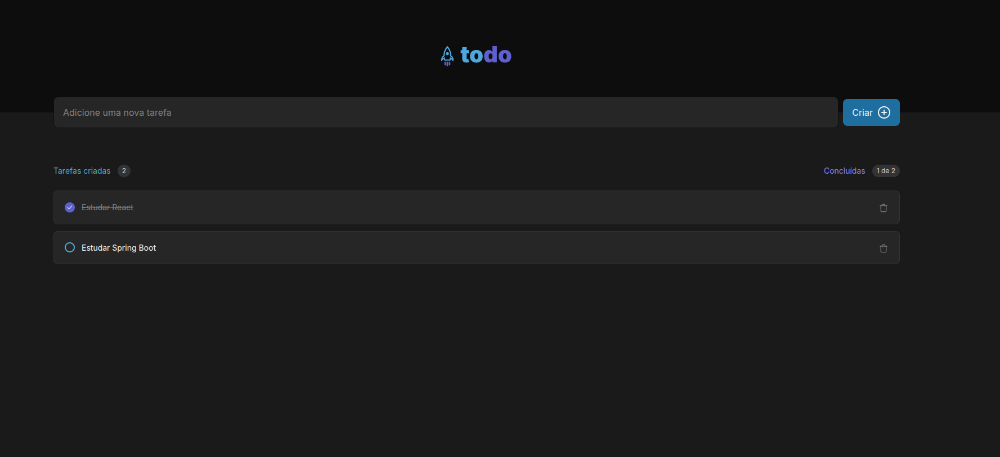

## TodoList
Uma aplicação completa de lista de tarefas com backend em Java/Spring Boot e frontend em React + TypeScript, utilizando Tailwind CSS para estilização.

### 🚀 Funcionalidades

Criar novas tarefas
Listar todas as tarefas
Marcar tarefas como concluídas
Excluir tarefas
Contador de tarefas concluídas
Interface responsiva e moderna

### 🛠️ Tecnologias
Backend

Java 21
Spring Boot 3.4.5
Spring Data JPA
Spring Validation
Banco de dados H2 (em memória)
Lombok
Maven

Frontend

React 18
TypeScript
Tailwind CSS 4
Vite
Lucide React (ícones)

### 📋 Pré-requisitos

Java 21
Node.js (versão recomendada: 20.x ou superior)
npm ou yarn

Backend

Clone o repositório
bashgit clone https://github.com/seu-usuario/todolist.git
cd todolist

Compile e execute o projeto Spring Boot
bash./mvnw spring-boot:run
O servidor estará disponível em http://localhost:8080

Frontend

Navegue até a pasta do frontend
bashcd frontend

Instale as dependências
bashnpm install
# ou
yarn

Execute o projeto
bashnpm run dev
# ou
yarn dev
O frontend estará disponível em http://localhost:5173

### 🌐 Endpoints da API
MétodoEndpointDescriçãoGET/tasksRetorna todas as tarefasPOST/tasksCria uma nova tarefaPUT/tasks/{id}Atualiza o status de uma tarefaDELETE/tasks/{id}Remove uma tarefa
Exemplos de Requisições
Criar uma tarefa
httpPOST /tasks
Content-Type: application/json

{
  "description": "Estudar Spring Boot",
  "complete": false
}
Atualizar status da tarefa
httpPUT /tasks/{id}
Content-Type: application/json

{
  "complete": true
}

### 📁 Estrutura do Projeto
Backend
O backend segue uma arquitetura em camadas:

controllers: Responsáveis por receber as requisições HTTP
services: Contém a lógica de negócio da aplicação
dtos: Objetos de transferência de dados
exceptions: Tratamento de exceções personalizadas

Frontend
O frontend é organizado em componentes reutilizáveis:

components: Componentes da interface como Button, Input, Item, etc.
interfaces: Definições de tipos TypeScript

📸 Screenshots
Abaixo estão algumas capturas de tela da aplicação em funcionamento:

 

