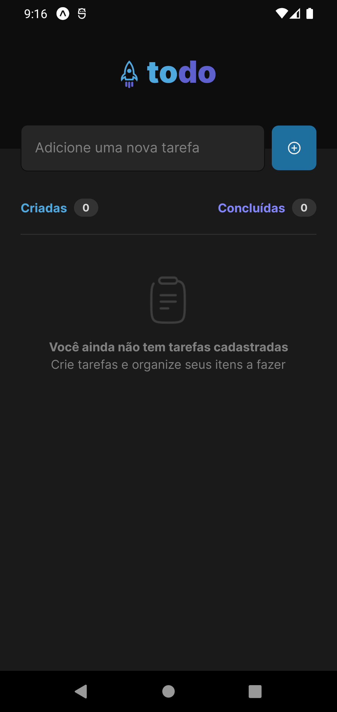
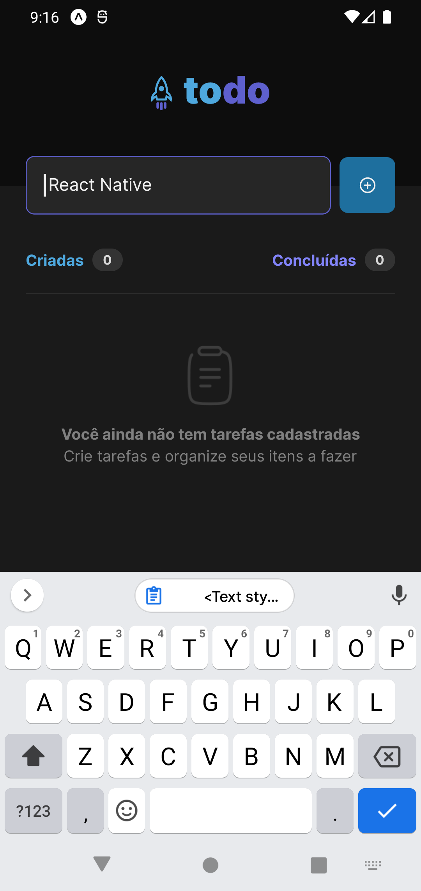
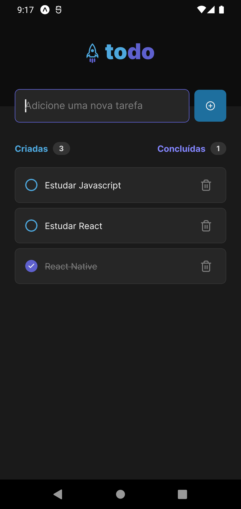

# 📱 TODO LIST

Este projeto é uma aplicação de **Todo List** desenvolvida com **Expo Router** e **React Native**, utilizando **TypeScript**.  

A aplicação permite ao usuário:  
- Criar tarefas  
- Alterar o status de uma tarefa para **Concluída**  
- Apagar tarefas   

A interface é estilizada com **StyleSheet**, destacando boas práticas de organização e simplicidade.  

---

## ✨ Tecnologias Utilizadas  

- **React Native**  
- **Expo Router**  
- **TypeScript**  
- **Biome.js** (para análise estática de código e formatação)  

---

## 📸 Imagens de Exemplo  

 

  

  


---

## ⚙️ Pré-requisitos  

- **Node.js** instalado.  
- Para rodar no smartphone:  
  - Instale o aplicativo **Expo Go**.  
- Para rodar no computador:  
  - Use um emulador Android (recomendado).  

---

## 🚀 Instalação e Execução  

1. Clone este repositório:  
   ```bash
   git clone https://github.com/seu-usuario/seu-repositorio.git
   cd seu-repositorio

2. Instale as dependências:

npm install

3. Inicie o servidor do Expo:

npx expo start -c
